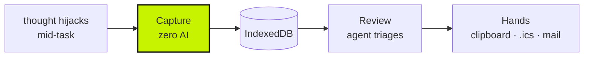
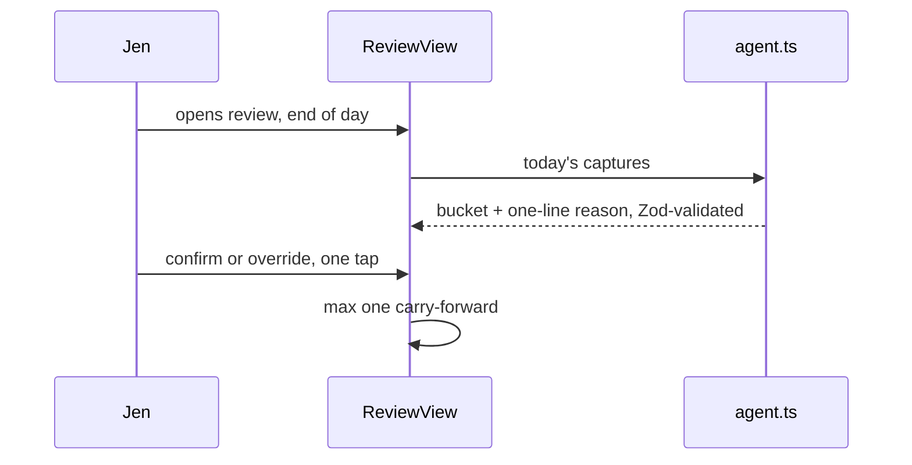

# Architecture

A distraction sheet that works. Park a hijacking thought in under five seconds, review it
later, see the pattern. Client-side only: no server, no account, no data leaving the
browser.

## The one decision everything follows from

**Capture and review are different jobs, and putting them in one interaction is what
breaks every other app.** Capture is dumb and fast: no analysis, no questions, no triage,
no network. All the intelligence happens later, in a separate screen, once the task that
was interrupted is already finished.

If capture is hard, the product has already failed.

## The review loop

The agent runs **here only**. No key means no agent, not no review. A rule-based
fallback still buckets everything, so the product works without BYOK.

## Stack

- React 19 + Vite + Tailwind v4, TypeScript
- Dexie over IndexedDB for local persistence, no server
- Zod on raw model output, because a model returning the wrong shape must fail loudly
- Gemini via BYOK. The key stays in the browser; TetherLog never sees it.

## Files

| Path | Job |
|------|-----|
| `src/views/CaptureView.tsx` | The one that must never get slower |
| `src/views/ReviewView.tsx` | Evening triage, where the agent earns its keep |
| `src/views/PatternsView.tsx` | Deterministic stats + weekly digest |
| `src/views/SettingsView.tsx` | BYOK, backup, import/export |
| `src/lib/agent.ts` | Triage call. `reviewBatchSchema.parse()` on the model's response |
| `src/lib/hands.ts` | Getting `do` items out: clipboard, `.ics`, share, mailto |
| `src/lib/voice.ts` | Recording and transcript. Input plumbing, not a coaching session |
| `src/db/index.ts` | Dexie schema: captures, wins, settings |

## The rules that are not negotiable

**Zero AI at capture time.** No "did you mean", no live summarising, no network call. Ten
seconds of runway exist before the thought is gone; a clarifying question spends all of it.

**Review is a calm room.** No streaks, no overdue badges, no "you missed yesterday". An
untriaged capture from three days ago is a parked thought, not a failure state. The moment
a review screen punishes the backlog, people stop opening it and the backlog wins.

**Four screens.** Capture, Review, Patterns, Settings. Do not invent a fifth.

## Out of scope

Accounts, sync, a server, anything that makes capture slower. The writing lane, the
one-tap phone install and the service-worker nudge are specced and unbuilt. See
`ROADMAP.md`.

Product intent and the full rule set: `PRODUCT.md`. Visual contract: `docs/LOOK.md`.
What is decided: `docs/DECISIONS.md`. What is specified but unbuilt: `docs/BUILD-SPEC.md`.
