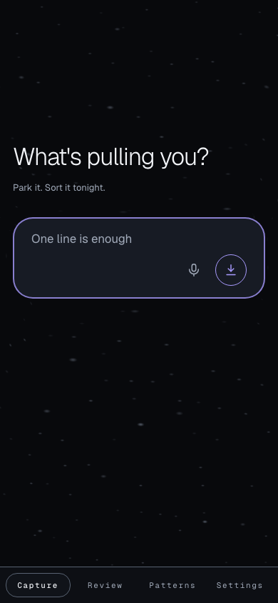

# TetherLog

**Log what's pulling you. Review later. See the pattern.**

ND capture log — dumb-fast park, agent-powered evening review, pattern detection, hands that export your `do` items.



See `ARCHITECTURE.md` for how it fits together, `PRODUCT.md` for the full spec.

## Privacy

Captures stay on your device. Optional AI uses **your** API key (BYOK), stored in the browser only. Capture and patterns work without a key.

## Dev

```bash
npm install
npm run dev
```

## Stack

Vite · React 19 · TypeScript · Tailwind v4 · Dexie · PWA
